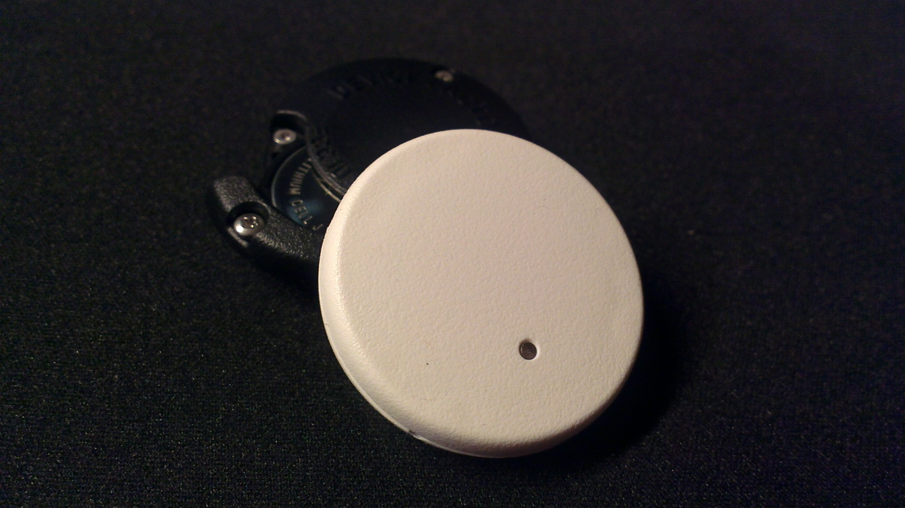

DF1-IOS
=======

**About:** This repository is for Device Factory iOS applications.  These apps are intended to be for demonstration purposes.  They can be compiled and install in an iOS product and used to control the DF1 device.

**Contents:**
* docs - Supporting files and documentaion
* ios-lib - Base librabry to communicate with DF1
* ios-demo - Main demo app for DF1

BLE Services Doc
================

For details on available GATT services and related characteristics, refer to:

[DF1Services Document](docs/DF1Services.md)

How To: Compile and Install
===========================

These are the steps required to complie the code in the repo and install on an iOS device.  The prerequisite is that you have [registered](https://developer.apple.com/register) as an Apple [developer](https://developer.apple.com) and installed [Xcode](https://developer.apple.com/xcode) development software.

*Step 1:* Clone this repo to your Apple Mac computer.
* Create a directory on your computer to hold Device Factory repos, I call mine "devicefactory" ;)
* In the directory where you keep repos enter: git clone https://github.com/devicefactory/df1-ios

*Step 2:* Start Xcode and load the df1-ios project.
* From the Xcode "File" tab select "Open"
* In the "df1-ios" directory choose the file: "df1-ios-workgroup.xcworkspace"
* This should open the "df1-isodemo"

*Step 3:* Connect your iOS device and select as a destination.

